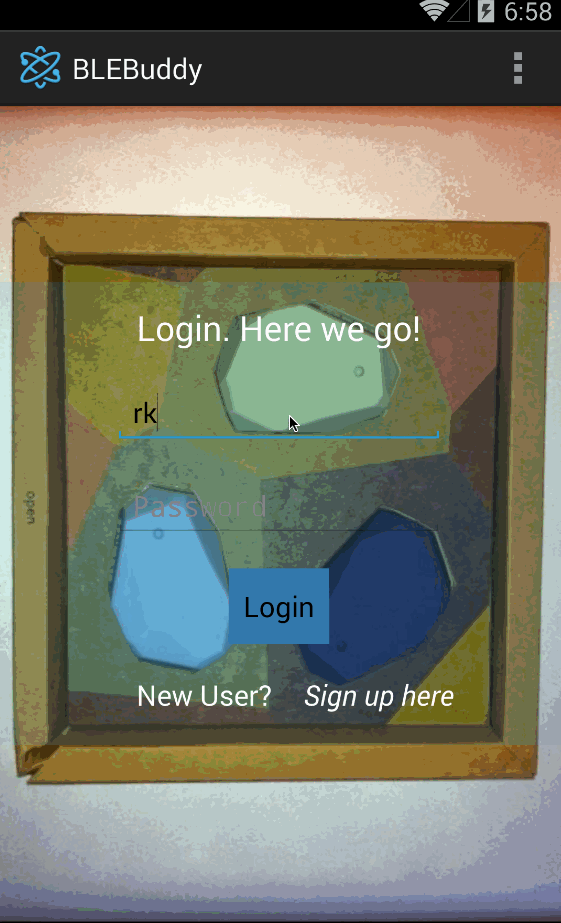

ProjectBeacon
=============

The magic of beacons

* [x] Login screen
* [x] Signup screen
* [x] Integration with ParseUser Apis
* [x] Handling logins and signups
      ** TODO - Email verification - http://blog.parse.com/2012/04/03/introducing-app-email-settings/
* [x] Service to efficiently scan for bluetooth beacons in the background.
* [x] Activity to show list of beacons scanned by the device and list of beacons saved by the user
* [x] User can select a beacon from the list of new beacons scanned by the device and add to his beacons
* [X] User can select a beacon from a list of his beacons and update its friendly name.  
    

